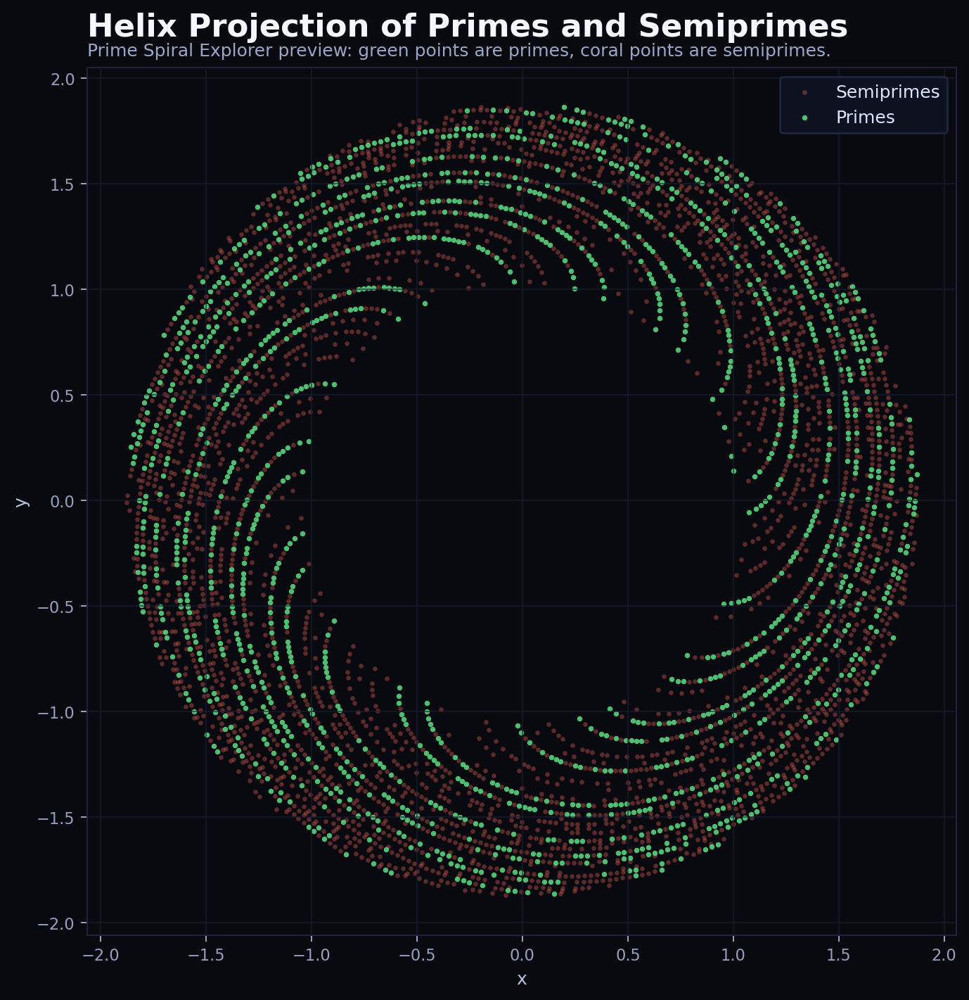
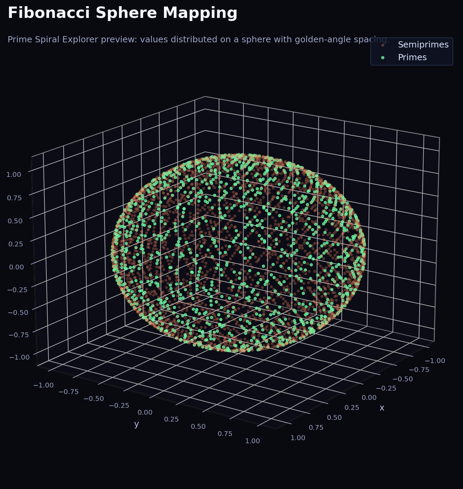
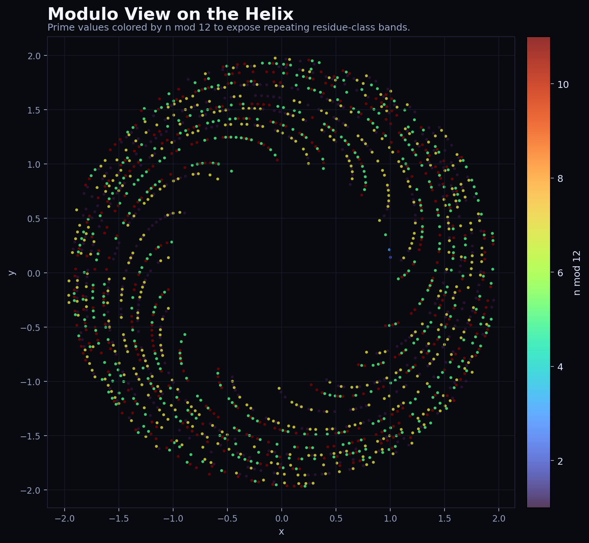
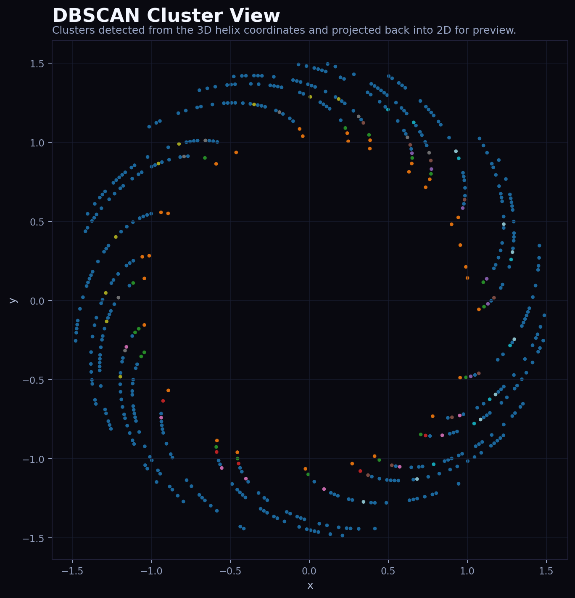

# Prime Spiral Explorer

Prime Spiral Explorer is an interactive **prime number visualization** and number-theory exploration project focused on **prime numbers** and **semiprimes**. It combines multiple geometric mappings, analytics views, and a publishable static frontend so the result can be explored locally or shared as a public portfolio project through GitHub Pages.

The core motivation behind the project is visual exploration: to understand whether primes and semiprimes exhibit different spatial behavior when embedded into 3D structures such as the Ulam tower, helix projections, and related layouts. Instead of treating primes only as an abstract sequence on the number line, the project asks whether geometric representation can make structural differences easier to see.

## Research note

A longer research-style note based on the original project motivation is available here:

- [Research note: Spatial separation of primes and semiprimes in the three-dimensional Ulam spiral](docs/research-note.md)

## Preview

### Helix projection

This view projects the sequence into a spiral-like radial structure. Prime and semiprime distributions begin to form visible bands and gaps instead of looking like random raw values.



### Fibonacci sphere mapping

This view spreads values across a sphere using golden-angle spacing. It is useful for spotting how prime and semiprime distributions behave when projected onto a compact 3D surface.



### Modulo helix view

The modulo view recolors the helix by residue class. Instead of just showing where primes sit, it highlights repeating arithmetic bands through modular coloring.



### DBSCAN cluster view

This preview shows cluster detection on the helix coordinates. It is a fast way to inspect whether local neighborhoods form structured groupings or mostly behave like noise.



## What the project shows

- Prime and semiprime structure across multiple geometric mappings.
- A helix-based view for circular layering and residue-style patterns.
- A Ulam-inspired projection for grid structure and diagonal alignment.
- Additional interactive views for Fibonacci sphere, DBSCAN clustering, modulo coloring, zeta mapping, vector directions, and validation analytics.
- A fully static HTML output in `docs/index.html`, so the public version can be deployed without a backend.

## Quick start

### Requirements

- Python 3.12 or newer
- A modern desktop browser

### Run locally

```powershell
python -m venv .venv
.venv\Scripts\Activate.ps1
pip install -r requirements.txt
python main.py
```

The script generates the public site into `docs/index.html` and opens it in the browser.

## How to use the explorer

1. Open the generated page.
2. Use the top `View` buttons to switch between Helix, Ulam 3D tower, Fibonacci sphere, clustering, modulo, zeta, vector, and validation modes.
3. Use `Filter` to show both sets, primes only, or semiprimes only.
4. In `Modulo` mode, move the slider to recolor values by `n mod k`.
5. In `Pure Ulam validation`, switch between `Downsample`, `Weighting`, and `Residual` to inspect the analytical comparison panels.

## Refresh README preview images

If you update the underlying math or styling and want new README visuals:

```powershell
.venv\Scripts\Activate.ps1
python tools\generate_readme_images.py
```

This regenerates the static preview diagrams in `assets/readme/`.

## Publish on GitHub Pages

1. Push the repository to GitHub.
2. Open `Settings -> Pages`.
3. Set `Source` to `Deploy from a branch`.
4. Select branch `main` and folder `/docs`.
5. Save.

GitHub Pages will publish `docs/index.html` as the public entry point.

## Project structure

- `main.py` generates the interactive HTML site in `docs/`.
- `docs/index.html` is the publishable static page.
- `tools/generate_readme_images.py` creates static diagram previews for the README.
- `assets/readme/` stores repository preview images.
- `requirements.txt` lists the Python dependencies.
